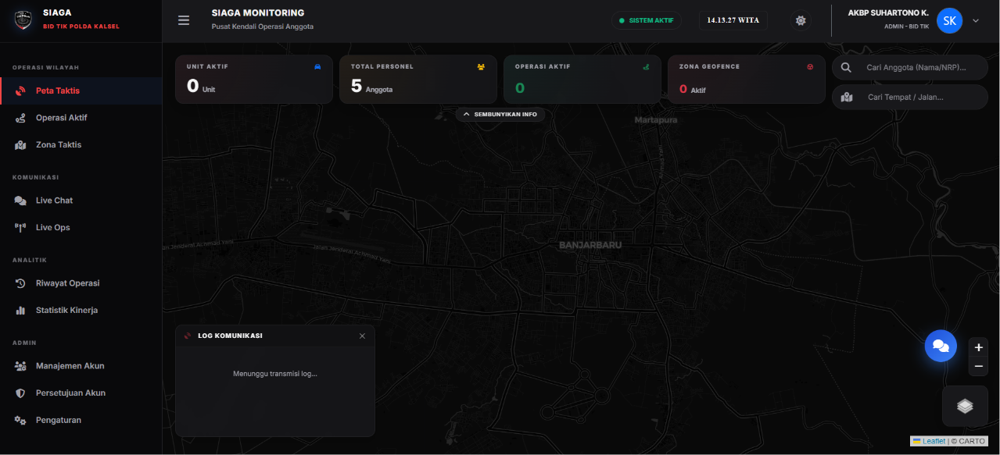
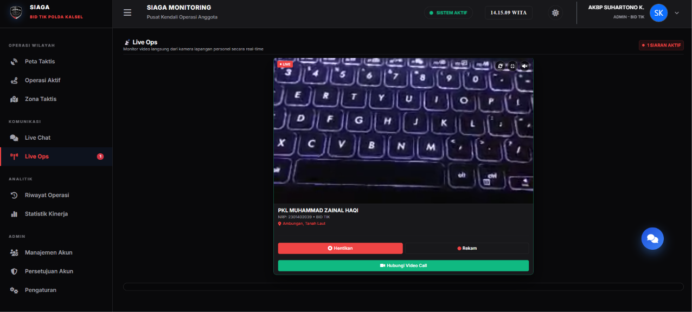
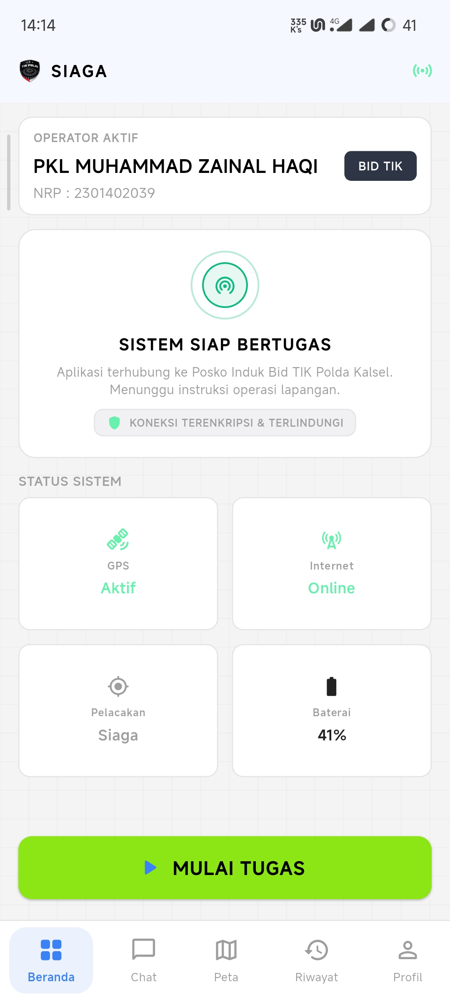
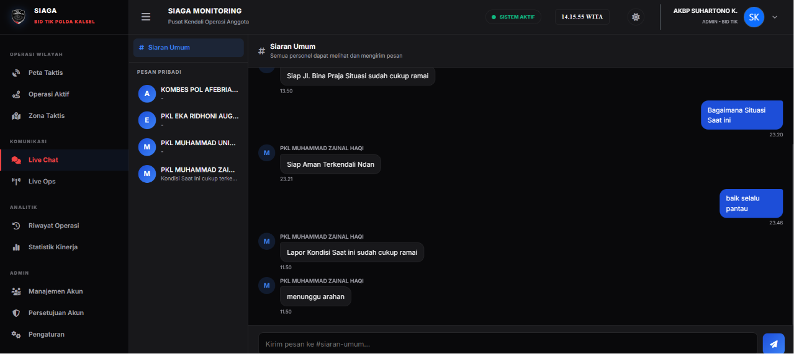

<div align="center">
  

  # 🛡️ SIAGA
  ### Sistem Informasi Aktivitas dan Gerak Anggota

  **Platform pemantauan & pelacakan personel kepolisian secara *real-time***

  <sub>Dikembangkan selama program PKL (Praktik Kerja Lapangan) — Bidang TIK, Kepolisian Daerah Kalimantan Selatan</sub>

  <br/>

  [](https://flutter.dev)
  [](https://firebase.google.com)
  [](https://webrtc.org)
  [](https://developer.mozilla.org/en-US/docs/Web/JavaScript)
  [](#)

</div>

<br/>

## 📑 Daftar Isi

- [🛡️ Tentang Proyek](#️-tentang-proyek)
- [✨ Fitur Utama](#-fitur-utama)
- [🖼️ Cuplikan Layar](#️-cuplikan-layar)
- [🏗️ Arsitektur & Teknologi](#️-arsitektur--teknologi)
- [📁 Struktur Repositori](#-struktur-repositori)
- [⚠️ Keterbatasan Sistem (Known Limitations)](#️-keterbatasan-sistem-known-limitations)
- [🚀 Menjalankan Proyek](#-menjalankan-proyek)
- [👤 Kontribusi](#-kontribusi)

<br/>

## 🛡️ Tentang Proyek

**SIAGA** adalah sistem pemantauan dan pelacakan operasional personel kepolisian secara *real-time*, dibangun untuk mendukung kegiatan pengamanan wilayah, pengamanan kegiatan, dan patroli oleh Polda Kalimantan Selatan. Sistem ini memungkinkan komando (Polda/Polres/Polsek) memantau posisi, status, dan aktivitas personel di lapangan langsung melalui peta digital — lengkap dengan komunikasi chat dan siaran video langsung antara personel dan pusat komando.

Proyek ini terbagi menjadi **dua aplikasi utama yang saling terintegrasi** dan terhubung ke basis data Firebase secara langsung:

<table>
<tr>
<td width="50%" valign="top">

### 📱 Aplikasi Mobile — `siaga_tracker/`
*Dikhususkan untuk Anggota/Personel Lapangan*
- 📍 **Pelacakan Lokasi:** Berbagi koordinat GPS secara berkala di latar belakang (background service).
- 🎥 **Live Video Streaming:** Menyiarkan video langsung dari kamera ponsel ke Command Center.
- 💬 **Komunikasi Chat:** Mengirim & menerima pesan taktis dari pusat komando.
- 📋 **Laporan Tugas:** Melakukan absen mulai/selesai dinas secara mandiri.

</td>
<td width="50%" valign="top">

### 💻 Dashboard Web — Command Center
*Dikhususkan untuk Komandan & Administrator*
- 🗺️ **Peta Taktis:** Memantau seluruh personel aktif di peta interaktif secara dinamis.
- 🛡️ **Geofencing:** Mengatur batas area tugas patroli secara visual.
- 🔴 **Monitor Streaming:** Menerima dan menyaksikan siaran langsung video dari personel lapangan.
- 👥 **Manajemen Pengguna:** Menyetujui pendaftaran akun anggota baru dan mengelola izin akses.

</td>
</tr>
</table>

<br/>

## ✨ Fitur Utama

- **Live GPS Tracking:** Pelacakan posisi real-time dengan interval dinamis 10 detik dan filter jarak minimum 2 meter untuk menghemat baterai ponsel.
- **Zona Taktis / Geofencing:** Deteksi otomatis masuk/keluar area operasi personel dengan notifikasi visual langsung di peta dashboard.
- **Komunikasi Dua Arah:** Chat publik (grup), pesan pribadi (Direct Message), dan perintah komando penting langsung ke individu.
- **Live Streaming WebRTC:** Siaran video berkualitas HD 720p dari lapangan ke dashboard menggunakan protokol peer-to-peer WebRTC dengan latency ultra rendah.
- **Keamanan Berbasis Peran:** Hak akses terbagi menjadi 3 level (Admin, Commander, Member) yang diamankan melalui aturan keamanan basis data (Firebase Security Rules).
- **Alur Persetujuan Akun:** Pendaftaran mandiri oleh personel lapangan yang memerlukan persetujuan manual dari Admin sebelum akun dapat digunakan.

<br/>

## 🖼️ Cuplikan Layar

> [!NOTE]  
> Tangkapan layar di bawah ini menunjukkan antarmuka fungsional dari aplikasi web dashboard dan aplikasi mobile SIAGA.

<div align="center">
<table>
<tr>
<td align="center" width="50%">

<br/>
<sub><b>Peta Taktis — Dashboard Web</b></sub>
</td>
<td align="center" width="50%">

<br/>
<sub><b>Live Streaming — Live Ops</b></sub>
</td>
</tr>
<tr>
<td align="center" width="50%">

<br/>
<sub><b>Beranda — Aplikasi Mobile (Flutter)</b></sub>
</td>
<td align="center" width="50%">

<br/>
<sub><b>Live Chat & Perintah Taktis</b></sub>
</td>
</tr>
</table>
</div>

<br/>

## 🏗️ Arsitektur & Teknologi

```mermaid
graph TD
    subgraph Klien Lapangan
        Mobile[Aplikasi Mobile - Flutter]
    end

    subgraph Pusat Komando
        Web[Dashboard Web - Vanilla JS]
    end

    subgraph Firebase Cloud (Region: asia-southeast1)
        Auth[Firebase Authentication<br>NRP-Based Virtual Email]
        DB[(Firebase Realtime Database)]
    end

    Mobile <-->|Sync Real-time 2 Arah| DB
    Web <-->|Sync Real-time 2 Arah| DB
    Mobile -->|Autentikasi| Auth
    Web -->|Autentikasi| Auth
    
    Mobile <.->|Video Stream WebRTC / STUN| Web
```

### Detail Teknologi Utama

| Komponen | Teknologi | Keterangan |
|---|---|---|
| **Dashboard Web** | HTML5 · CSS3 · ES Modules · Leaflet.js · Bootstrap 5 | Antarmuka peta interaktif, performa ringan tanpa framework berat. |
| **Aplikasi Mobile** | Flutter (Dart) | Multiplatform, dioptimalkan khusus untuk perangkat Android. |
| **Peta Digital** | Leaflet.js + OpenStreetMap + Nominatim API | Render ubin peta cepat dengan integrasi pencarian alamat geocoding gratis. |
| **Basis Data** | Firebase Realtime Database | Sinkronisasi data real-time berbasis JSON dengan latency minimal. |
| **Autentikasi** | Firebase Auth | Skema masuk menggunakan kombinasi NRP (Nomor Registrasi Pokok) dan kata sandi. |
| **Live Streaming** | WebRTC (p2p) | Komunikasi video langsung dengan STUN server publik Google. |
| **Hosting** | Server Polri (cPanel) / Firebase Hosting | Fleksibilitas opsi deploy ke infrastruktur internal maupun cloud. |

<br/>

## 📁 Struktur Repositori

```text
├── index.html              # Halaman Utama Dashboard Web
├── login.html               # Halaman Masuk Administrator/Komandan
├── app.js                   # Logika Dashboard (Peta, Chat, Geofence, WebRTC)
├── style.css                # Kustomisasi UI Dashboard
├── database.rules.json      # Aturan Keamanan Firebase Realtime Database
├── firebase.json            # Konfigurasi Firebase Hosting & Deploy
├── assets/                  # Aset Gambar & Logo Polda
│   ├── logo_polda.png
│   └── mascot_presisi.png
├── docs/                    # Dokumentasi & Tangkapan Layar README
│   ├── peta-taktis.png
│   ├── live-streaming.png
│   ├── mobile-beranda.jpg
│   └── live-chat.png
└── siaga_tracker/            # Aplikasi Mobile (Proyek Flutter)
    ├── lib/                 # Kode Sumber Utama (Dart)
    │   ├── main.dart        # Logika Utama Aplikasi
    │   └── utils/           # Fungsi Pembantu & Helper
    ├── android/             # Konfigurasi Native Android
    └── pubspec.yaml         # Dependensi Proyek Flutter
```

<br/>

## ⚠️ Keterbatasan Sistem (Known Limitations)

> [!WARNING]  
> Proyek ini merupakan produk MVP (Minimum Viable Product) yang dibangun selama 20 minggu program PKL. Keterbatasan berikut perlu diperhatikan untuk pengembangan lanjutan:

1. **WebRTC Relaying:** Belum menggunakan TURN server. Pada jaringan dengan firewall/NAT ketat, streaming video berpotensi mengalami kendala koneksi peer-to-peer.
2. **Penyimpanan Gambar:** Foto profil personel saat ini disimpan sebagai String Base64 langsung di Realtime Database. Disarankan bermigrasi ke Firebase Storage di masa mendatang.
3. **Batas Sambungan:** Menggunakan Firebase Spark Plan (Gratis) yang memiliki batas maksimal 100 koneksi bersamaan (simultaneous connections).
4. **Android Package ID:** Identitas aplikasi Android masih menggunakan default `com.example.siaga_tracker`. Perlu diubah ke package ID resmi sebelum rilis produksi.
5. **Autentikasi Integrasi:** Menggunakan email virtual berbasis format NRP (`[nrp]@siaga.polri.go.id`) karena Firebase Authentication memerlukan format email standar.

<br/>

## 🚀 Menjalankan Proyek

### 1. Prasyarat (Prerequisites)
- Pastikan telah menginstal [Flutter SDK](https://docs.flutter.dev/get-started/install) pada komputer Anda.
- Buat proyek di [Firebase Console](https://console.firebase.google.com/) dan aktifkan **Authentication** (Email/Password) serta **Realtime Database** (Region: Singapore / `asia-southeast1`).
- Ekspor aturan keamanan dari file [database.rules.json](file:///c:/Users/User/siaga-polda-kalsel/database.rules.json) ke Firebase Realtime Database Rules Anda.

### 2. Konfigurasi Kredensial Firebase

#### A. Untuk Dashboard Web
Buat file `config.js` di direktori utama (atau edit bagian konfigurasi di [app.js](file:///c:/Users/User/siaga-polda-kalsel/app.js)):
```javascript
const firebaseConfig = {
  apiKey: "YOUR_API_KEY",
  authDomain: "YOUR_PROJECT_ID.firebaseapp.com",
  databaseURL: "https://YOUR_PROJECT_ID-default-rtdb.asia-southeast1.firebasedatabase.app",
  projectId: "YOUR_PROJECT_ID",
  storageBucket: "YOUR_PROJECT_ID.appspot.com",
  messagingSenderId: "YOUR_MESSAGING_SENDER_ID",
  appId: "YOUR_APP_ID"
};
```

#### B. Untuk Aplikasi Mobile
Unduh file `google-services.json` dari Firebase Console Anda dan tempatkan pada folder:
`siaga_tracker/android/app/google-services.json`

### 3. Eksekusi Aplikasi

**Menjalankan Dashboard Web:**
Jalankan file `index.html` menggunakan server lokal, misalnya ekstensi **Live Server** di VS Code atau menggunakan python:
```bash
# Menggunakan python server lokal
python -m http.server 8000
```
Buka `http://localhost:8000` pada peramban Anda.

**Menjalankan Aplikasi Mobile:**
```bash
cd siaga_tracker
flutter pub get
flutter run
```

<br/>

## 👤 Kontribusi

Proyek ini dirancang dan dikembangkan oleh **Haqi** — mahasiswa D4 Teknologi Rekayasa Komputer Jaringan, Politeknik Negeri Tanah Laut — sebagai bagian dari program Praktik Kerja Lapangan (PKL) di Bidang Teknologi Informasi dan Komunikasi (Bid TIK), Kepolisian Daerah Kalimantan Selatan.

---
<div align="center">
  
  <br/>
  <sub><b>Presisi — Prediktif, Responsibilitas, Transparansi Berkeadilan</b></sub>
</div>