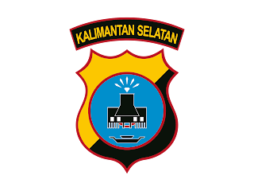

<div align="center">
  

  # 🛡️ SIAGA
  ### Sistem Informasi Aktivitas dan Gerak Anggota

  **Platform pemantauan & pelacakan personel kepolisian secara *real-time***

  <sub>Dikembangkan selama program PKL (Praktik Kerja Lapangan) — Bidang TIK, Polda Kalimantan Selatan</sub>

  <br/>

  
  
  
  
  

</div>

<br/>

## 📑 Daftar Isi

- [Tentang Proyek](#-tentang-proyek)
- [Fitur Utama](#-fitur-utama)
- [Cuplikan Layar](#-cuplikan-layar)
- [Arsitektur & Teknologi](#%EF%B8%8F-arsitektur--teknologi)
- [Struktur Repositori](#-struktur-repositori)
- [Keterbatasan Sistem](#%EF%B8%8F-keterbatasan-sistem-known-limitations)
- [Menjalankan Proyek](#-menjalankan-proyek)
- [Kontribusi](#-kontribusi)

<br/>

## 📖 Tentang Proyek

**SIAGA** adalah sistem pemantauan dan pelacakan operasional personel kepolisian secara *real-time*, dibangun untuk mendukung kegiatan pengamanan wilayah, pengamanan kegiatan, dan patroli oleh Polda Kalimantan Selatan. Sistem ini memungkinkan komando (Polda/Polres/Polsek) memantau posisi, status, dan aktivitas personel di lapangan langsung melalui peta digital — lengkap dengan komunikasi chat dan siaran video langsung antara personel dan pusat komando.

Proyek terdiri dari **dua aplikasi yang saling terhubung**, berbagi satu basis data yang sama secara real-time:

<table>
<tr>
<td width="50%" valign="top">

**📱 Aplikasi Mobile** — `siaga_tracker/`
Digunakan oleh anggota/personel lapangan untuk:
- Mengaktifkan GPS tracking
- Melapor mulai/akhiri tugas
- Live streaming & chat

</td>
<td width="50%" valign="top">

**💻 Dashboard Web** — `index.html` · `app.js`
Digunakan oleh Komandan & Administrator untuk:
- Memantau peta taktis
- Mengelola akun & zona geofence
- Melihat statistik & riwayat operasi

</td>
</tr>
</table>

<br/>

## ✨ Fitur Utama

| | Fitur | Deskripsi |
|:---:|---|---|
| 📍 | **Live GPS Tracking** | Pelacakan posisi real-time di peta taktis (Leaflet.js), throttling 10 detik & filter jarak 2 meter |
| 🗺️ | **Zona Taktis / Geofence** | Deteksi otomatis saat personel masuk/keluar area operasi |
| 💬 | **Live Chat & Perintah Taktis** | Chat umum, pesan pribadi (DM), dan perintah komando langsung ke individu |
| 🎥 | **Live Streaming (WebRTC)** | Siaran video HD 720p dari lapangan ke dashboard, dengan opsi rekam lokal |
| 👥 | **Role-Based Access** | Tiga peran — Admin / Commander / Member — ditegakkan di Security Rules & UI |
| 📊 | **Riwayat & Statistik** | Log aktivitas dan analitik kinerja personel |
| ✅ | **Alur Persetujuan Akun** | Pendaftaran mandiri dengan approval Admin sebelum akun aktif |

<br/>

## 🖼️ Cuplikan Layar

<div align="center">
<table>
<tr>
<td align="center" width="50%">

<br/>
<em>Peta Taktis — Dashboard Web</em>
</td>
<td align="center" width="50%">

<br/>
<em>Live Streaming — Live Ops</em>
</td>
</tr>
<tr>
<td align="center" width="50%">

<br/>
<em>Beranda — Aplikasi Mobile</em>
</td>
<td align="center" width="50%">

<br/>
<em>Live Chat & Perintah Taktis</em>
</td>
</tr>
</table>
</div>

> 💡 Simpan screenshot ke folder `docs/screenshots/` lalu ganti baris di atas dengan `` agar tampil otomatis di GitHub.

<br/>

## 🏗️ Arsitektur & Teknologi

```
 Aplikasi Mobile (Flutter) ──┐
                              ├──►  Firebase Realtime Database  (asia-southeast1)
 Dashboard Web (JS) ──────────┘                │
                                                │  listener real-time, 2 arah
                                                ▼
                                  Firebase Authentication
                                  (email virtual berbasis NRP)
```

<div align="center">

| Komponen | Teknologi |
|---|---|
| **Dashboard Web** | HTML5 · CSS3 · JavaScript (vanilla, ES Modules) · Bootstrap 5 · Leaflet.js · Chart.js |
| **Aplikasi Mobile** | Flutter (Dart) — target Android |
| **Autentikasi** | Firebase Authentication (skema email virtual berbasis NRP) |
| **Basis Data** | Firebase Realtime Database (region `asia-southeast1`) |
| **Peta Digital** | Leaflet.js + tile OpenStreetMap + pencarian lokasi via Nominatim API |
| **Live Streaming** | WebRTC peer-to-peer, ICE server STUN publik Google |
| **Hosting Produksi** | cPanel Server Polri *(Firebase Hosting tersedia sebagai cadangan)* |

</div>

<sub>**Dependensi mobile utama:** `firebase_core` · `firebase_auth` · `firebase_database` · `geolocator` · `flutter_map` · `flutter_webrtc` · `permission_handler` · `battery_plus` · `image_picker`</sub>

<br/>

## 📁 Struktur Repositori

```
├── index.html              # Dashboard web (entry point)
├── login.html               # Halaman login dashboard
├── app.js                   # Logika dashboard web (peta, chat, admin, dsb.)
├── style.css
├── database.rules.json      # Firebase Security Rules
├── firebase.json            # Konfigurasi Firebase Hosting
└── siaga_tracker/            # Aplikasi mobile (Flutter)
    ├── lib/main.dart
    ├── android/
    ├── assets/
    └── pubspec.yaml
```

<br/>

## ⚠️ Keterbatasan Sistem (Known Limitations)

> Proyek ini adalah hasil MVP dari program PKL 20 minggu. Keterbatasan berikut didokumentasikan secara transparan sebagai peta risiko untuk pengembangan lanjutan — bukan berarti sistem tidak layak pakai.

- Belum ada **TURN server** untuk WebRTC (hanya STUN publik) — streaming berpotensi gagal di balik NAT/firewall ketat
- `applicationId` Android masih default (`com.example.siaga_tracker`) — perlu diganti sebelum rilis ke Play Store
- Foto profil disimpan sebagai base64 di Realtime Database (bukan Firebase Storage) — mempercepat penggunaan kuota
- Kuota gratis Firebase (Spark plan) dibatasi **100 koneksi bersamaan**
- Belum ada automated testing maupun CI/CD
- Distribusi APK masih manual (bukan via Play Store)
- Baru mendukung Bahasa Indonesia

<br/>

## 🚀 Menjalankan Proyek

**Dashboard Web**
```bash
# buka index.html lewat local server, mis. Live Server di VS Code
```

**Aplikasi Mobile**
```bash
cd siaga_tracker
flutter pub get
flutter run
```

> Perlu file konfigurasi Firebase (`google-services.json`) yang tidak disertakan di repo publik ini untuk alasan keamanan.

<br/>

## 👤 Kontribusi

Dikembangkan oleh **Haqi** — mahasiswa D4 Teknologi Rekayasa Komputer Jaringan, Politeknik Negeri Tanah Laut — sebagai bagian dari Praktik Kerja Lapangan (PKL) di Bidang TIK, Polda Kalimantan Selatan.

<br/>

<div align="center">

<br/>
<sub>Dokumentasi teknis lengkap & buku panduan pengguna tersedia terpisah dari repositori ini.</sub>
</div>